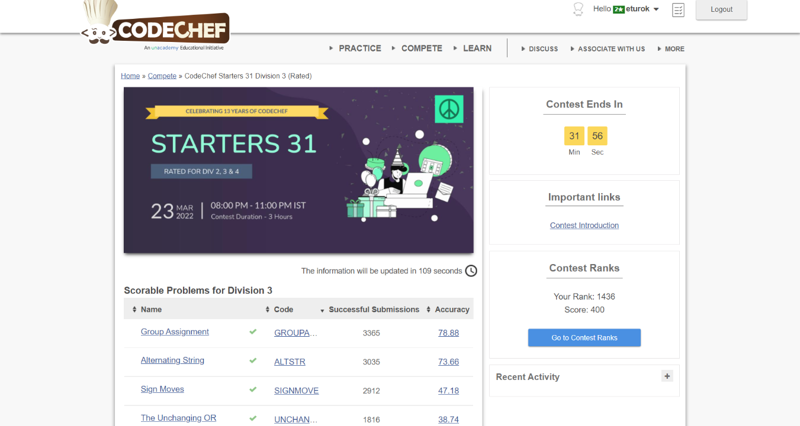

### Codechef Starters 31 Division 3 (March 23, 2022)
Contest [questions](https://www.codechef.com/START31C?order=desc&sortBy=successful_submissions 'Link to Contest Questions'); 
contest results: 4/7.

###### My Solutions
* [Alternating String](https://github.com/ez2rok/coding-contests/blob/main/week9/codechef_starters_31_division_3/alternating_string.py)
* [Group Assignment](https://github.com/ez2rok/coding-contests/blob/main/week9/codechef_starters_31_division_3/group_assignment.py)
* [Sign Moves](https://github.com/ez2rok/coding-contests/blob/main/week9/codechef_starters_31_division_3/sign_moves.py)
* [The Unchanging Or](https://github.com/ez2rok/coding-contests/blob/main/week9/codechef_starters_31_division_3/the_unchanging_or.py)

