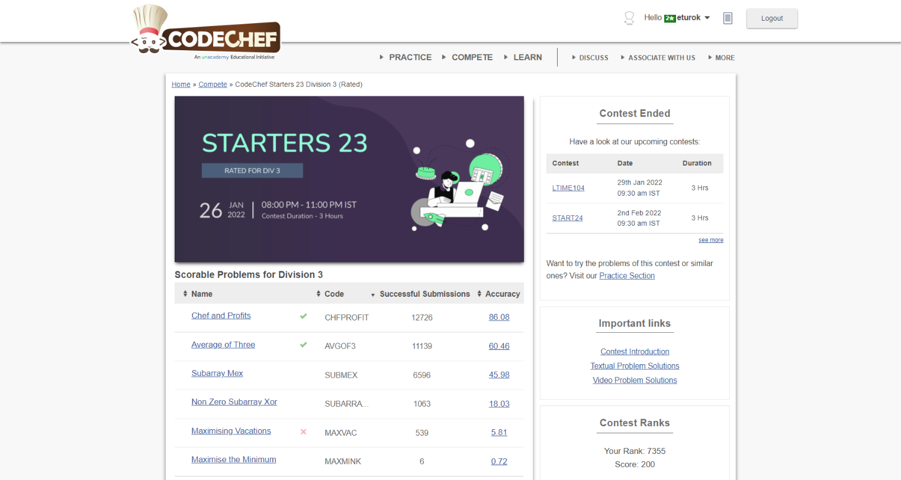

### Leetcode Weekly Contest 277 (January 22, 2022)
Contest [questions](https://www.codechef.com/START23C?order=desc&sortBy=successful_submissions 'Link to Contest Questions'); 
contest results: 2/6.

###### My Solutions
* [Average of Three](https://github.com/ez2rok/coding-contests/blob/main/week2/contests/codechef_starters3_division3/average_of_three.py)
* [Chef and Profits](https://github.com/ez2rok/coding-contests/blob/main/week2/contests/codechef_starters3_division3/chef_and_profits.py)

