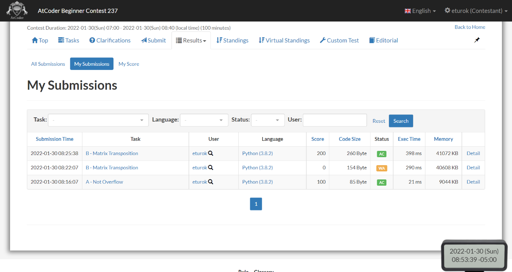

### Atcoder Beginner Contest (abc) 237 (January 30, 2022)
Contest [questions](https://atcoder.jp/contests/abc237 'Link to Contest Questions').
Contest results: 2/8.

###### My Solutions
* [Matrix Transposition](https://github.com/ez2rok/coding-contests/blob/main/week3/contests/atcoder_abc237/matrix_transposition.py)
* [Not Overflow](https://github.com/ez2rok/coding-contests/blob/main/week3/contests/atcoder_abc237/not_overflow.py)
 
