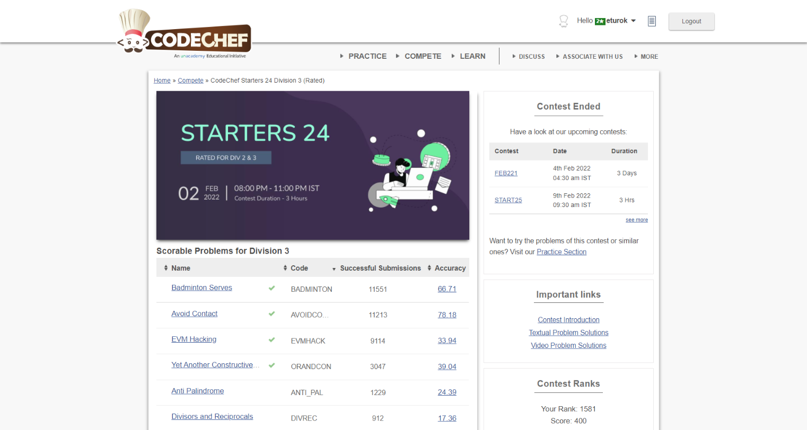

### Codechef Starters 24 Division 3 (February 2nd, 2022)
Contest [questions](https://www.codechef.com/START24C?order=desc&sortBy=successful_submissions 'Link to Contest Questions'); 
contest results: 4/7.

###### My Solutions
* [Avoid Contact](https://github.com/ez2rok/coding-contests/blob/main/week3/contests/codechef_starters_24_division_3/avoid_contact.py)
* [Badminton Serves]https://github.com/ez2rok/coding-contests/blob/main/week3/contests/codechef_starters_24_division_3/badminton_serves.py
* [EVM Hacking](https://github.com/ez2rok/coding-contests/blob/main/week3/contests/codechef_starters_24_division_3/evm_hacking.py)
* [Yet Another Constructive Problem](https://github.com/ez2rok/coding-contests/blob/main/week3/contests/codechef_starters_24_division_3/yet_another_constructive_problem.py)

