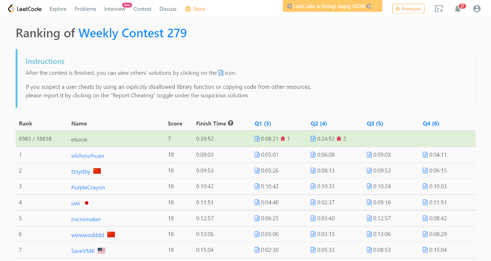

### Leetcode Weekly 279 (February 6th, 2022)
Contest [questions](https://leetcode.com/contest/weekly-contest-279/ 'Link to Contest Questions').
Contest results: 2/4.

###### My Solutions
* [Smallest Value of the Rearranged Number](https://github.com/ez2rok/coding-contests/blob/main/week4/contests/leetcode_weekly_279/smallest_value_of_the_rearranged_number.py)
* [Sort Even and Odd Indices Independently](https://github.com/ez2rok/coding-contests/blob/main/week4/contests/leetcode_weekly_279/sort_even_and_odd_indices_independently.py)

 
