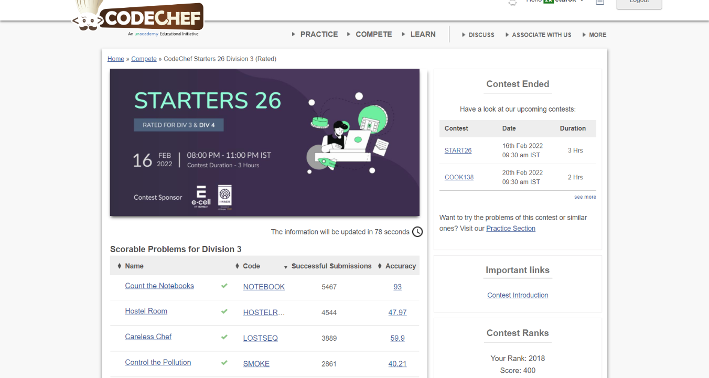

### Codechef Starters 26 Division 3 (February 16, 2022)
Contest [questions](https://www.codechef.com/START26C?order=desc&sortBy=successful_submissions); 
contest results: 4/6.

###### My Solutions
* [Careless Chef](https://github.com/ez2rok/coding-contests/blob/main/week5/contests/codechef_starters_26_division_3/careless_chef.py)
* [Control the Pollution](https://github.com/ez2rok/coding-contests/blob/main/week5/contests/codechef_starters_26_division_3/control_the_pollution.py)
* [Count the Notebooks](https://github.com/ez2rok/coding-contests/blob/main/week5/contests/codechef_starters_26_division_3/count_the_notebooks.py)
* [Hostel Room](https://github.com/ez2rok/coding-contests/blob/main/week5/contests/codechef_starters_26_division_3/hostel_room.py)

