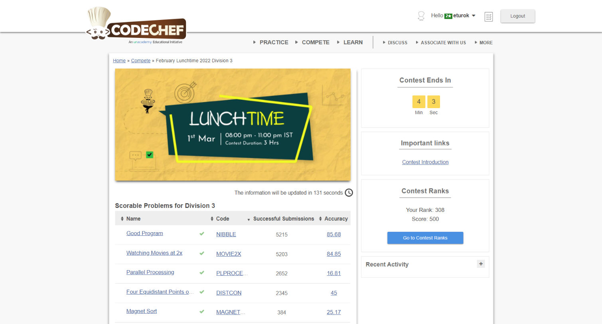

### Codechef Lunchtime March (March 1, 2022)
Contest [questions](https://www.codechef.com/LTIME105C?order=desc&sortBy=successful_submissions); 
contest results: 5/7.

###### My Solutions
* [Good Program](https://github.com/ez2rok/coding-contests/blob/main/week7/contests/codechef_lunchtime_march/good_program.py)
* [Four Equidistant Points on a Grid](https://github.com/ez2rok/coding-contests/blob/main/week7/contests/codechef_lunchtime_march/four_equidistant_points_on_a_grid.py)
* [Magnet Sort](https://github.com/ez2rok/coding-contests/blob/main/week7/contests/codechef_lunchtime_march/magnet_sort.py)
* [Parallel Processing](https://github.com/ez2rok/coding-contests/blob/main/week7/contests/codechef_lunchtime_march/parallel_processing.py)
* [Watching Movies at 2x](https://github.com/ez2rok/coding-contests/blob/main/week7/contests/codechef_lunchtime_march/watching_movies_at_2x.py)

