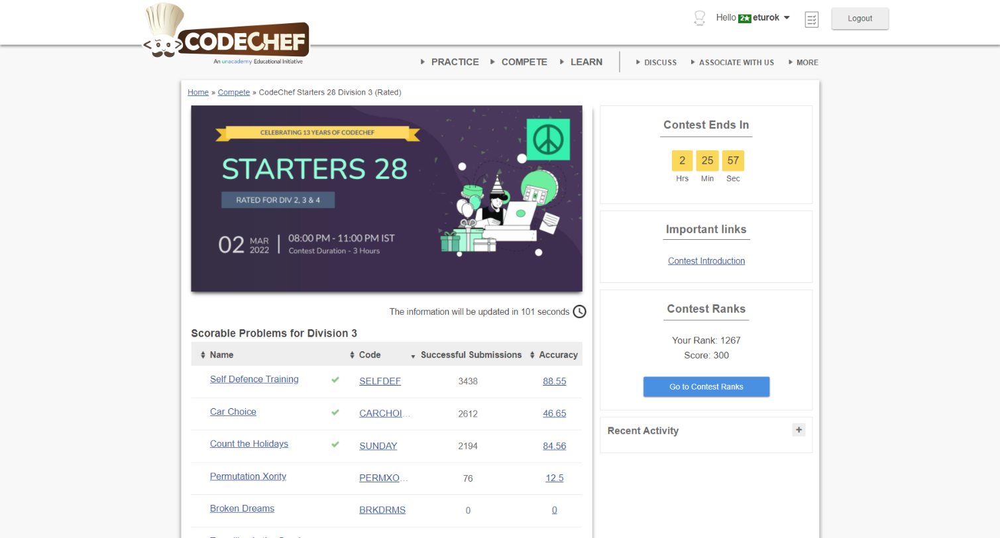

### Codechef Starters 28 Division 3 (March 2nd, 2022)
Contest [questions](https://www.codechef.com/START28C?order=desc&sortBy=successful_submissions);
contest results 3/7.

###### My Solutions
* [Car Choice](https://github.com/ez2rok/coding-contests/blob/main/week7/contests/codechef_starters_division_3/car_choice.py)
* [Count the Holidays](https://github.com/ez2rok/coding-contests/blob/main/week7/contests/codechef_starters_division_3/count_the_holidays.py)
* [Self Defence Training](https://github.com/ez2rok/coding-contests/blob/main/week7/contests/codechef_starters_division_3/self_defence_training.py)

