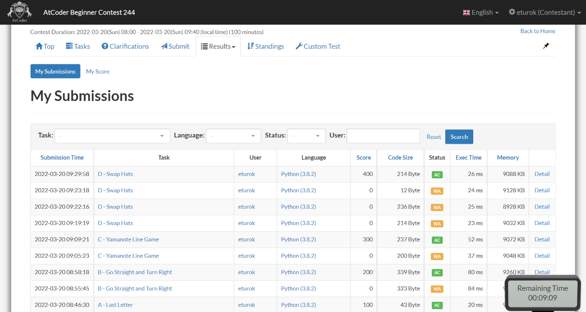

### Atcoder Beginner 244 (March 20, 2022)
Contest [questions](https://atcoder.jp/contests/abc244); 
contest results: 4/8.

###### My Solutions
* [Go Straight and Turn Right](https://github.com/ez2rok/coding-contests/blob/main/week9/atcoder_beginner_244/go_straight_and_turn_right.py)
* [Last Letter](https://github.com/ez2rok/coding-contests/blob/main/week9/atcoder_beginner_244/last_letter.py)
* [Swap Hats](https://github.com/ez2rok/coding-contests/blob/main/week9/atcoder_beginner_244/swap_hats.py)
* [Yamanote Line Game](https://github.com/ez2rok/coding-contests/blob/main/week9/atcoder_beginner_244/yamanote_line_game.py)

