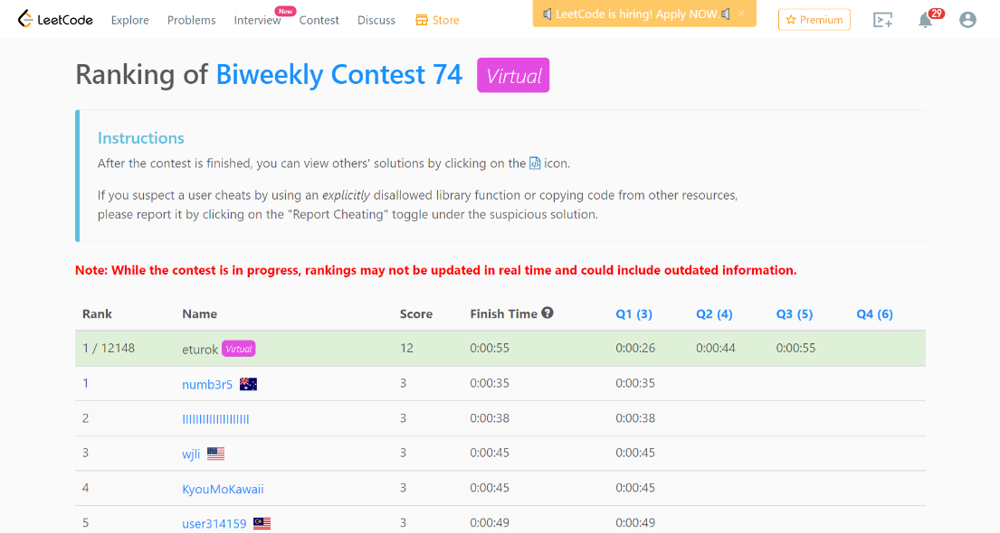

### Leetcode Biweekly Contest 74 (March 21, 2022)
Contest [questions](https://leetcode.com/contest/biweekly-contest-74/ 'Link to Contest Questions'); 
contest results: 3/4.

###### My Solutions
* [Divide Array Into Equal Pairs](https://github.com/ez2rok/coding-contests/blob/main/week9/leetcode_biweekly_74/divide_array_into_equal_pairs.py)
* [Maximize Number of Subsequences in a String](https://github.com/ez2rok/coding-contests/blob/main/week9/leetcode_biweekly_74/maximize_number_of_subsequences_in_a_string.py)
* [Minimum Operations to Halve Array](https://github.com/ez2rok/coding-contests/blob/main/week9/leetcode_biweekly_74/minimum_operations_to_halve_array_sum.py)

