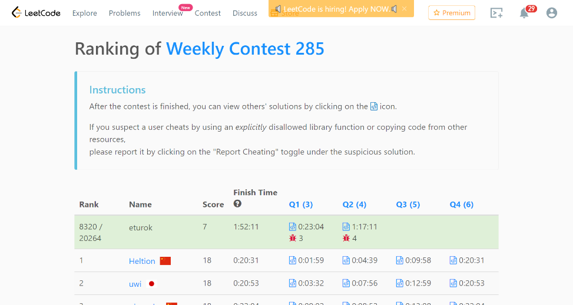

### Leetcode Weekly Contest 285 (March 20, 2022)
Contest [questions](https://leetcode.com/contest/weekly-contest-285/ 'Link to Contest Questions'); 
contest results: 2/4.

###### My Solutions
* [Count Collisions on a Road](https://github.com/ez2rok/coding-contests/blob/main/week9/leetcode_weekly_285/count_collisions_on_a_road.py)
* [Count Hills and Valleys in an Array](https://github.com/ez2rok/coding-contests/blob/main/week9/leetcode_weekly_285/count_hills_and_valleys_in_an_array.py)

