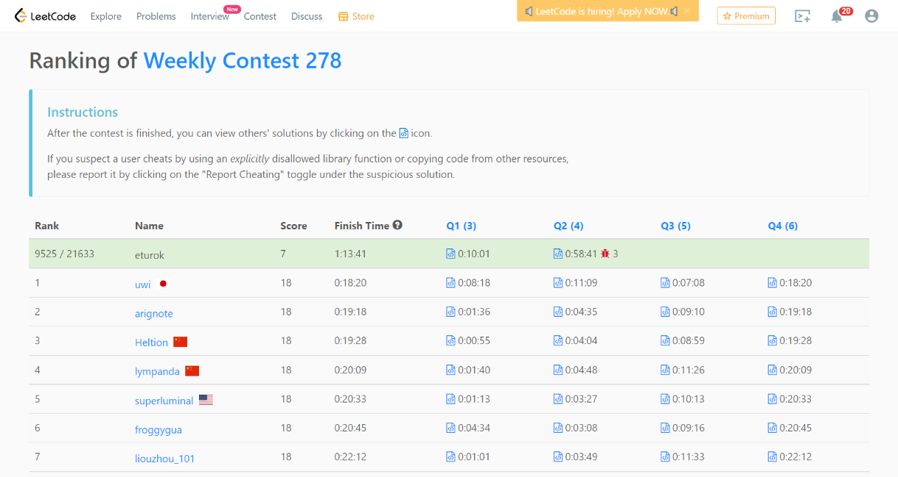

### Leetcode Weekly Contest 278 (January 29, 2022)
Contest [questions](https://leetcode.com/contest/weekly-contest-278/ 'Link to Contest Questions'); 
contest results: 2/4.

###### My Solutions
* [Keep Multiplying Found Values by Two](https://github.com/ez2rok/coding-contests/blob/main/week3/contests/leetcode_weekly/2154_keep_multiplying_found_values_by_two.py)
* [All Divisions With the Highest Score of a Binary Array](https://github.com/ez2rok/coding-contests/blob/main/week3/contests/leetcode_weekly/2155_all_divisions_with_the_highest_score_of_a_binary_array.py)

