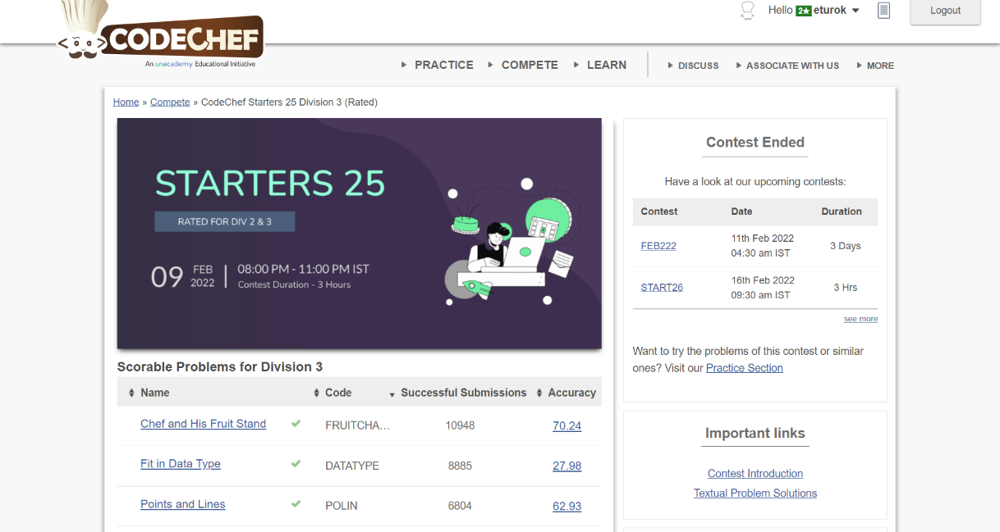

### Codechef Starters 25 Division 3 (February 9th, 2022)
Contest [questions](https://www.codechef.com/START25C?order=desc&sortBy=successful_submissions 'Link to Contest Questions'); 
contest results: 3/7.

###### My Solutions
* [Chef and his Fruit Salad](https://github.com/ez2rok/coding-contests/blob/main/week4/contests/codechef_starters_25_division_3/chef_and_his_fruit_stand.py)
* [Fit in Data Type](https://github.com/ez2rok/coding-contests/blob/main/week4/contests/codechef_starters_25_division_3/fit_in_data_type.py)
* [Points and Lines](https://github.com/ez2rok/coding-contests/blob/main/week4/contests/codechef_starters_25_division_3/points_and_lines.py)

