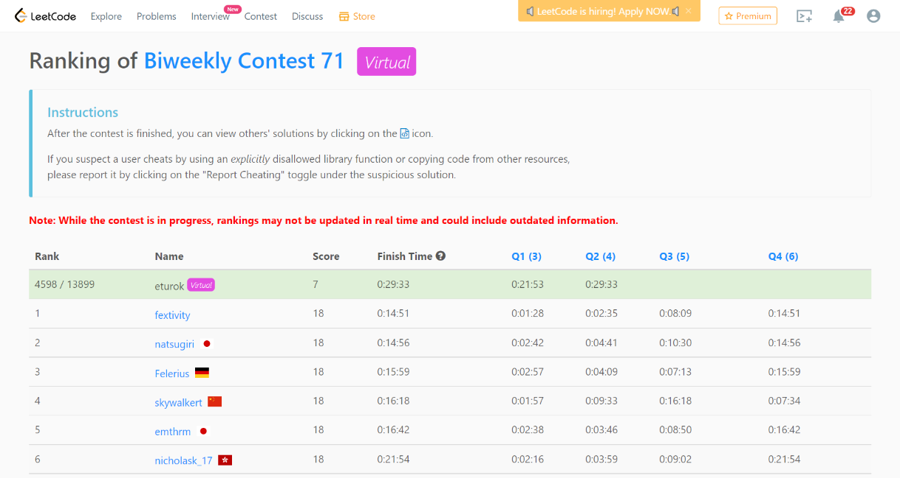

### Leetcode BiWeekly 71 (February 11th, 2022)
Contest [questions](https://leetcode.com/contest/biweekly-contest-71/ 'Link to Contest Questions').
Contest results: 2/4.

I was not able to take this coding test on the original date due to religious reasons. Professor Lim gave me permission to take this exam on a later date.

###### My Solutions
* [Minimum Sum of Four Digit Number After Splitting Digits](https://github.com/ez2rok/coding-contests/blob/main/week4/contests/leetcode_biweekly_71/minimum_sum_of_four_digit_number_after_splitting_digits.py)
* [Partition Array According to Given Pivot](https://github.com/ez2rok/coding-contests/blob/main/week4/contests/leetcode_biweekly_71/partition_array_according_to_given_pivot.py)

 
