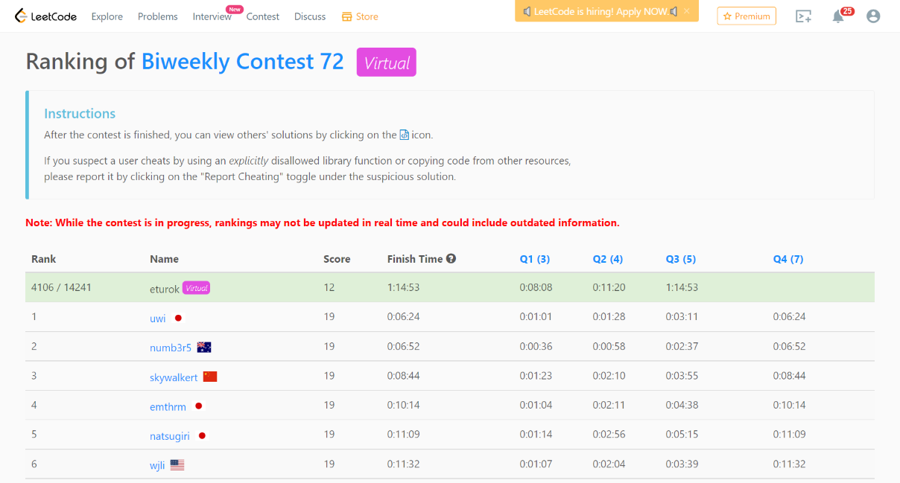

### Leetcode Biweekly (February 24, 2022)
Contest [questions](https://leetcode.com/contest/biweekly-contest-72/); 
contest results: 3/4.

For religious reasons, I took this leetcode contest as a virtual test; Professor Lim said this is okay.

###### My Solutions
* [Count Equal and Divisible Pairs in an Array](https://github.com/ez2rok/coding-contests/blob/main/week_6/leetcode_biweekly_72/count_equal_and_divisible_pairs_in_an_array.py)
* [Find Three Consecutive Integers That Sum to a Given Number](https://github.com/ez2rok/coding-contests/blob/main/week_6/leetcode_biweekly_72/find_three_consecutive_integers_that_sum_to_a_given_number.py)
* [Maximum Split of Positive Even Integers](https://github.com/ez2rok/coding-contests/blob/main/week_6/leetcode_biweekly_72/maximum_split_of_positive_even_integers.py)
* 

