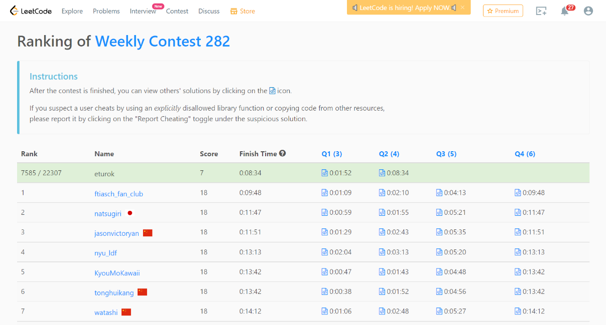

### Leetcode Weekly 282 (February 26th, 2022)
Contest [questions](https://leetcode.com/contest/weekly-contest-282/);
contest results 2/4.

###### My Solutions
* [Counting Words With a Given Prefix](https://github.com/ez2rok/coding-contests/blob/main/week7/contests/leetcode_weekly_282/counting_word_with_a_given_prefix.py)
* [Minimum Number of Steps to Make Two Strings Anagram II](https://github.com/ez2rok/coding-contests/blob/main/week7/contests/leetcode_weekly_282/minimum_number_of_steps_to_make_two_strings_anagram_II.py)

