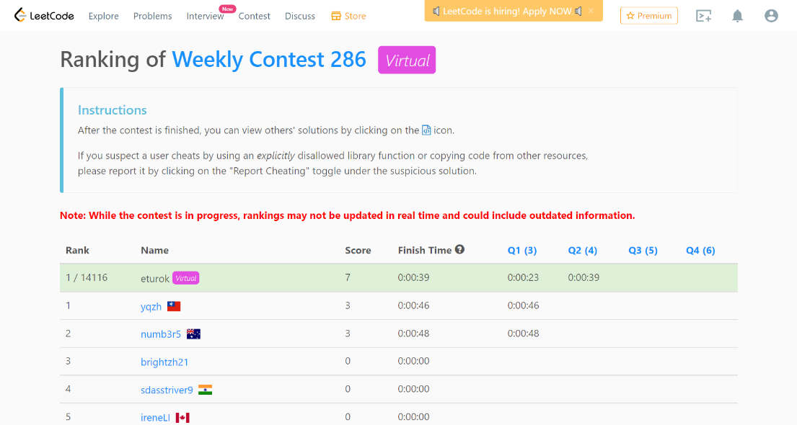

### Leetcode Weekly 286 (March 29, 2022)
Contest [questions]https://leetcode.com/contest/weekly-contest-286 'Link to Contest Questions'); 
contest results: 2/4.

###### My Solutions
* [Find the Difference of Two Arrays](https://github.com/ez2rok/coding-contests/blob/main/week_011/leetcode_weekly_286/find_the_difference_of_two_arrays.py)
* [Minimum Deletions to Make Array Beautiful](https://github.com/ez2rok/coding-contests/blob/main/week_011/leetcode_weekly_286/minimum_deletions_to_make_array_beautiful.py)

