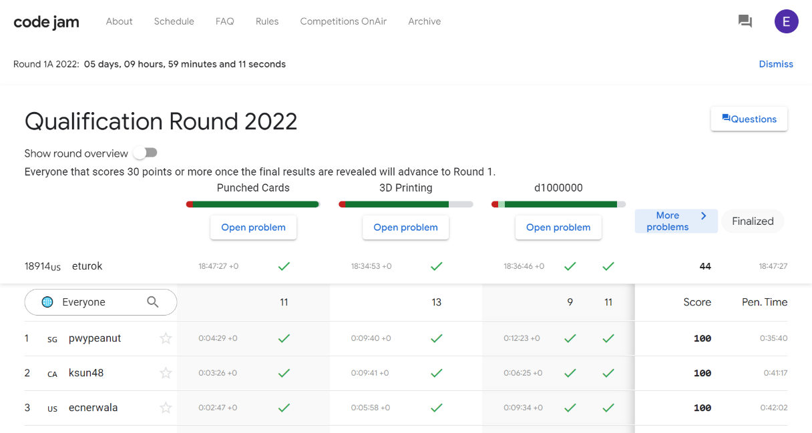

### Google Code Jam Qualification Round (April 3, 2022)
Contest [questions](https://codingcompetitions.withgoogle.com/codejam/round/0000000000876ff1 'Link to Contest Questions'); 
contest results: 3/5 questions, 44/100 points.

###### My Solutions
* [3D Printing](https://github.com/ez2rok/coding-contests/blob/main/week_012/google_code_jam_qualification_round/3D_printing.py)
* [d1000000](https://github.com/ez2rok/coding-contests/blob/main/week_012/google_code_jam_qualification_round/d1000000.py)
* [Punched Cards](https://github.com/ez2rok/coding-contests/blob/main/week_012/google_code_jam_qualification_round/punched_cards.py)

