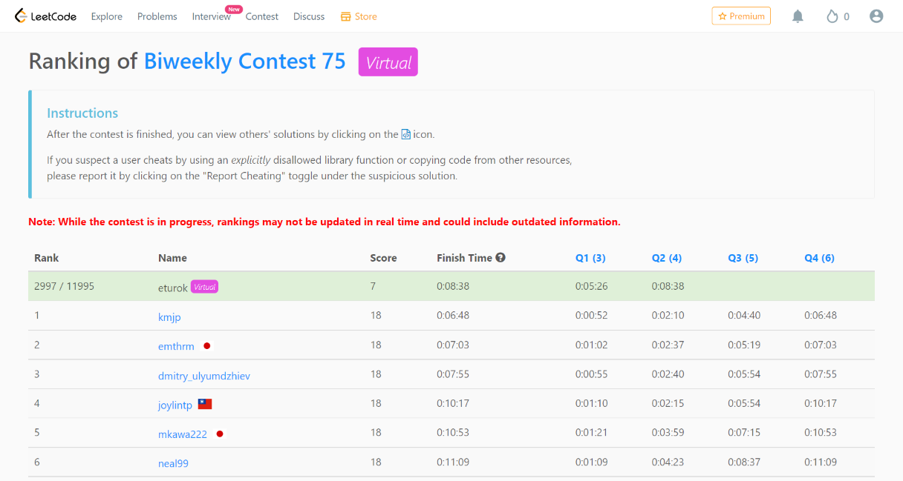

### Leetcode Biweekly 75 (April 5, 2022)
Contest [questions](https://leetcode.com/contest/biweekly-contest-75/ 'Link to Contest Questions'); 
contest results: 2/4.

###### My Solutions
* [Find Triangular Sum of an Array](https://github.com/ez2rok/coding-contests/blob/main/week_012/leetcode_biweekly_75/find_triangular_sum_of_an_array.py)
* [Minimum Bit Flips to Convert a Number](https://github.com/ez2rok/coding-contests/blob/main/week_012/leetcode_biweekly_75/minimum_bit_flips_to_convert_a_number.py)

