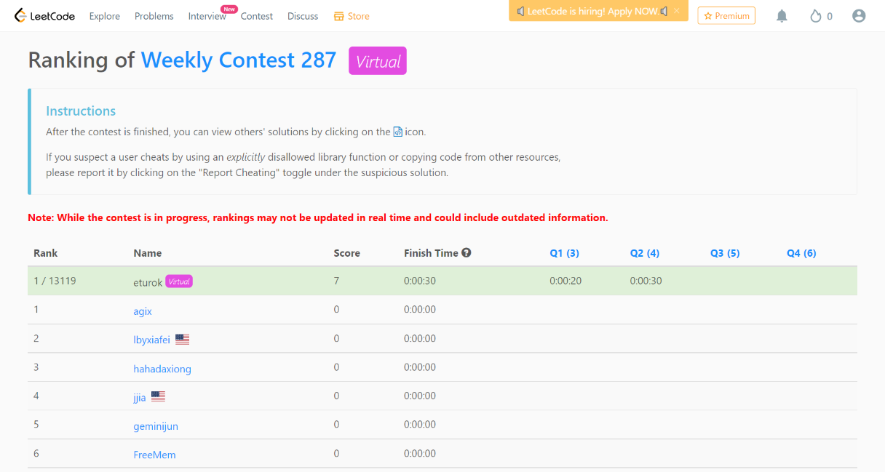

### Leetcode Weekly 287 (April 5, 2022)
Contest [questions](https://leetcode.com/contest/weekly-contest-287/ 'Link to Contest Questions'); 
contest results: 2/4.

For religious reasons, I did not partake in this contest on Saturday but rather on a later date.

###### My Solutions
* [Find Players With Zero or One Loss](https://github.com/ez2rok/coding-contests/blob/main/week_012/leetcode_weekly_287/find_players_with_zero_or_one_loss.py)
* [Minimum Number of Operations to Convert Time](https://github.com/ez2rok/coding-contests/blob/main/week_012/leetcode_weekly_287/minimum_number_of_operations_to_convert_time.py)

