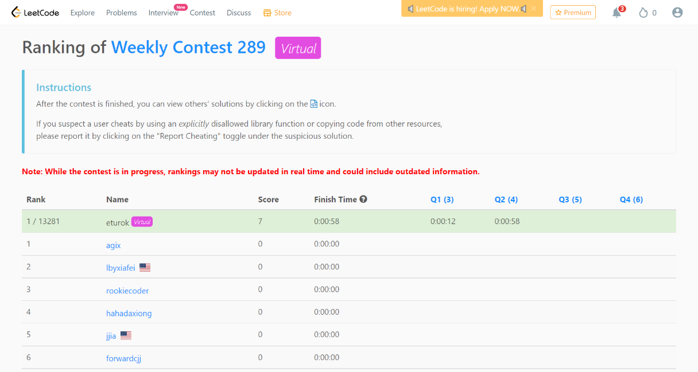

### Leetcode Weekly 289 (April 18, 2022)
Contest [questions](https://leetcode.com/contest/weekly-contest-289/ 'Link to Contest Questions'); 
contest results: 2/4.

Note: I did not complete this coding contest on the original date for religious reasons. It was on a Saturday.

###### My Solutions
* [Calculate Digit Sum of a String](https://github.com/ez2rok/coding-contests/blob/main/week_014/leetcode_weekly_289/calculate_digit_sum_of_a_string.py)
* [Minimum Rounds to Complete All Taks](https://github.com/ez2rok/coding-contests/blob/main/week_014/leetcode_weekly_289/minimum_rounds_to_complete_all_tasks.py)

