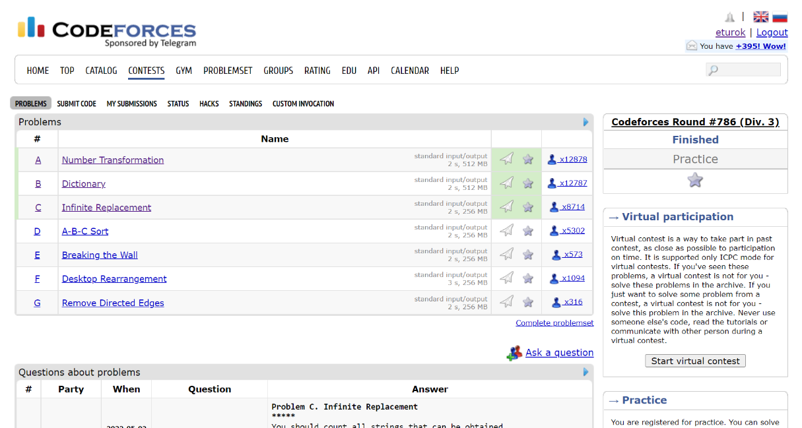

### Codeforces Round 786 (May 02, 2022)
Contest [questions](https://codeforces.com/contest/1674 'Link to Contest Questions'); 
contest results: 3/7.

###### My Solutions
* [Dictionary](https://github.com/ez2rok/coding-contests/blob/main/week_016/codeforces_round_786/dictionary.py)
* [Infinite Replacement](https://github.com/ez2rok/coding-contests/blob/main/week_016/codeforces_round_786/infinite_replacement.py)
* [Number Transformation](https://github.com/ez2rok/coding-contests/blob/main/week_016/codeforces_round_786/number_transformation.py)

