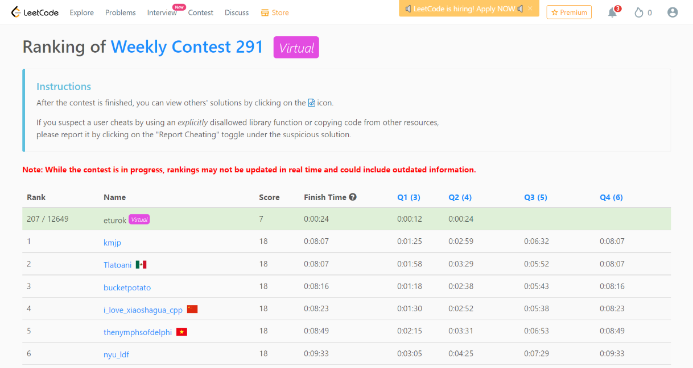

### Leetcode Weekly 291 (May 6, 2022)
Contest [questions](https://leetcode.com/contest/weekly-contest-291/ 'Link to Contest Questions'); 
contest results: 2/4.

Note: I was unable to complete this exam on its original date for religious reasons.

###### My Solutions
* [Minimum Consecutive Cards to Pick Up](https://github.com/ez2rok/coding-contests/blob/main/week_016/leetcode_weekly_291/minimum_consecutive_cards_to_pickup.py)
* [Remove Digit from Number to Maximize Result](https://github.com/ez2rok/coding-contests/blob/main/week_016/leetcode_weekly_291/remove_digit_from_number_to_maximize_result.py)

