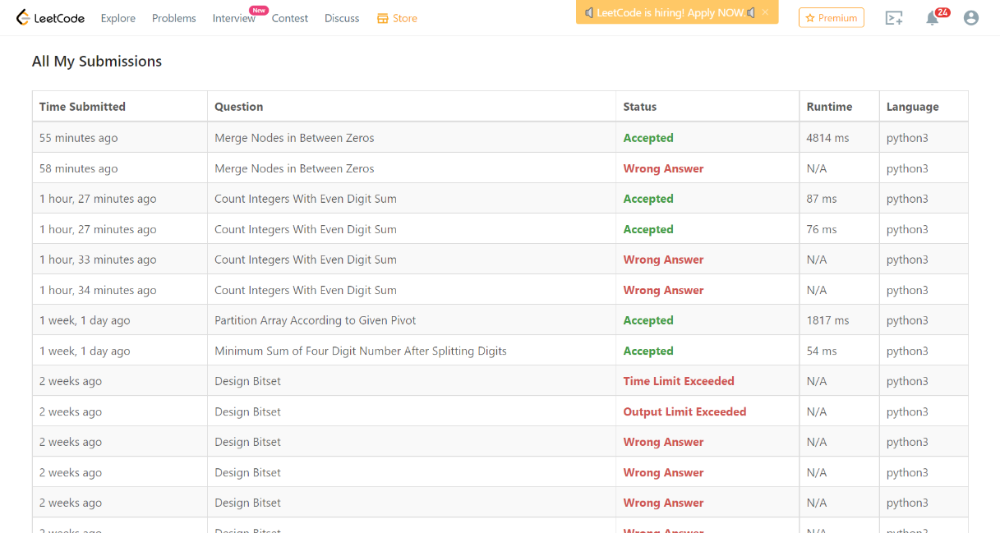

### Leetcode Weekly (February 20, 2022)
Contest [questions](https://leetcode.com/contest/weekly-contest-281/); 
contest results: 2/4.

###### My Solutions
* [Count Integers with Even Sum](https://github.com/ez2rok/coding-contests/blob/main/week_6/leetcode_weekly_281/count_integers_with_even_digit_sum.py)
* [Merge Nodes in Between Zeros](https://github.com/ez2rok/coding-contests/blob/main/week_6/leetcode_weekly_281/merge_nodes_in_between_zeros.py)
* 

